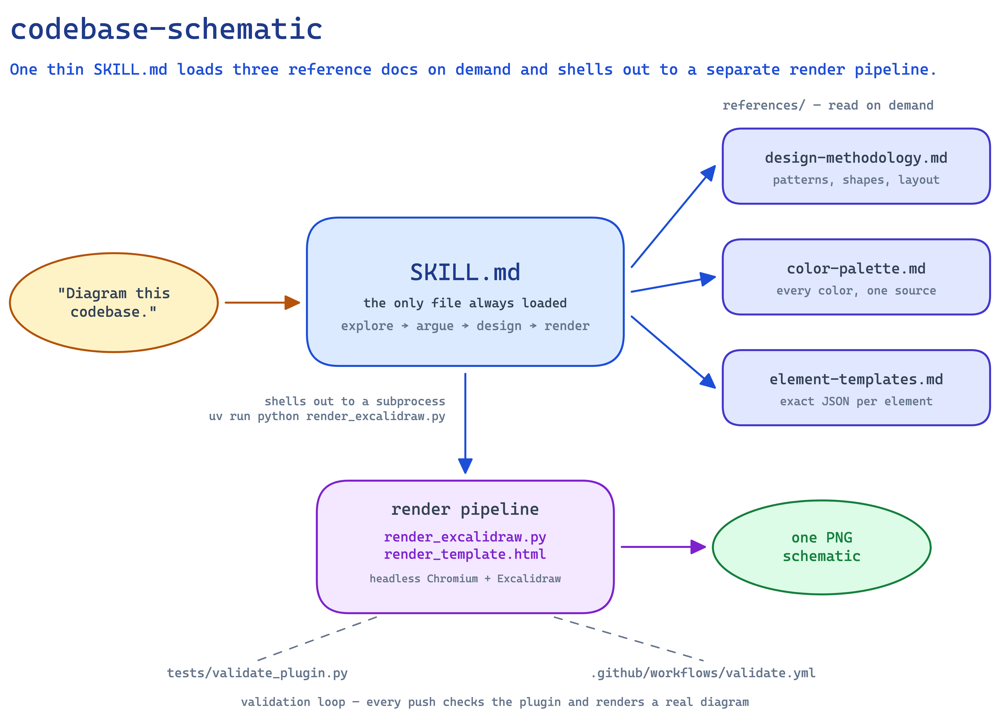

# codebase-schematic

A Claude Code plugin that turns a codebase into **one PNG diagram that argues
a specific point about its architecture** — not a decorative box-and-arrow
illustration of the file tree.



*The diagram above is this repo diagramming itself — see [`examples/self/`](examples/self/) for the full worked example.*

---

## What it does

Ask it to diagram a codebase, and it:

1. **Reads** the repo — README, manifests, directory structure, entry points — the same way it would to answer any other question about the code. No AST parser, no dependency-graph extraction tool.
2. **Finds the one structural fact worth showing** — strict layering, a plugin/dispatch system, a pipeline, independent packages sharing one core, a mirrored pair of subsystems — and states it as a single sentence before drawing anything.
3. **Designs a diagram that argues that fact**, using a small, deliberate visual-pattern library (fan-out, layers, timeline, tree, convergence, mirrored pair) and a fixed semantic color palette.
4. **Renders it to a real PNG**, looks at the actual rendered image, and fixes what's wrong — clipped text, overlapping shapes, misrouted arrows — before calling it done.
5. **Delivers the PNG** (and the editable `.excalidraw` source), and offers — never assumes — to embed it in the target repo's README.

One diagram style. One argument per diagram. That narrowness is deliberate — see [Design philosophy](#design-philosophy) below.

---

## Usage

Once installed, just ask for a diagram in a Claude Code conversation, run
from (or pointed at) the repo you want diagrammed:

```
Diagram this codebase's architecture.
```

It also triggers on: "show me the architecture visually," "create a
schematic of how this project fits together," "visualize this codebase's
structure," "draw a picture of how this repo is organized."

**Input**: nothing you have to prepare. No flags, no config file. The
skill reads the target codebase itself — README, manifest files
(`package.json`, `pyproject.toml`, etc.), directory structure, and entry
points — the same way Claude would to answer any other question about it.
There is no separate parser or dependency-extraction tool to feed.

**Output**: two files, delivered as attachments —

- a PNG — the rendered schematic
- the `.excalidraw` source next to it, so the diagram can be hand-edited
  later in [excalidraw.com](https://excalidraw.com) or the Excalidraw
  desktop/VS Code app

They're built in a scratch/working location, not inside the codebase
being diagrammed — nothing lands in the target repo's working tree by
default. It will *offer*, never assume, to also embed the PNG in the
target repo's README, the way this repo's own
[`examples/self/`](examples/self/) diagram is embedded above; only then
do the files get written into the repo itself.

Scope: one diagram per invocation, arguing one structural fact about the
codebase (see [Design philosophy](#design-philosophy) below) — not a
comprehensive multi-diagram technical reference.

---

## Design philosophy

**A diagram either argues something or it's a labeled list.** Before any JSON gets written, the skill has to answer one question: *if someone could see only one thing about how this codebase is put together, what should it be?* Common answers — strict layering, a small core fanning out to plugins, a pipeline, a mirrored pair of subsystems — each map to a specific visual pattern, and the skill picks exactly one per diagram. Mixing patterns is treated as a sign the argument wasn't actually narrowed down.

**The core test**: strip every label from the diagram — does the shape and arrangement alone still communicate the argument? If a diagram only makes sense with its labels intact, it's a list wearing a diagram's clothes.

**Dependency arrows are always one-directional.** Even when two modules reference each other's types, the diagram shows the direction that matters for the argument being made — never a double-headed arrow that says nothing about which side actually depends on the other.

**No invented structure.** If a codebase genuinely has nothing more important than anything else, the skill says so and diagrams the flattest honest version, rather than manufacturing a hierarchy to make the output look more interesting than the code actually is.

**Render, view, fix — never ship from JSON alone.** A diagram's JSON coordinates cannot tell you whether text clips, arrows cross through the wrong shape, or the composition is lopsided. The skill renders to PNG, reads the actual image, and iterates until it would show it to someone without a caveat.

---

## Modular components

```
codebase-schematic/
├── .claude-plugin/
│   ├── plugin.json                    # plugin manifest
│   └── marketplace.json               # single-plugin marketplace (source: "./")
├── skills/codebase-schematic/
│   ├── SKILL.md                       # the workflow: explore → argue → design → render → deliver
│   └── references/
│       ├── design-methodology.md      # shape meaning, layout principles, the render→view→fix loop
│       ├── color-palette.md           # every color used, one source of truth
│       ├── element-templates.md       # copy-paste JSON per Excalidraw element type
│       ├── render_excalidraw.py       # renders .excalidraw JSON → PNG via headless Chromium
│       ├── test_render_excalidraw.py  # pytest coverage for the render pipeline
│       ├── render_template.html       # loads @excalidraw/excalidraw from esm.sh, calls exportToSvg
│       ├── pyproject.toml             # the render pipeline's one dependency: playwright
│       └── uv.lock                    # generated by `uv sync`, not hand-edited
├── examples/self/                     # a real, rendered schematic of this repo's own structure
├── tests/validate_plugin.py           # frontmatter checks + a regression guard (see below)
├── .github/workflows/validate.yml     # CI: the validator, plus a full render smoke test
└── LICENSE                            # MIT
```

`SKILL.md` is deliberately thin — it states the workflow and defers every
detail to `references/`, which it reads on demand. The render pipeline
(`render_excalidraw.py` + `render_template.html`) is a separate, self-contained
unit the skill shells out to as a subprocess; it has exactly one runtime
dependency (`playwright`) and no other code in this repo depends on it.

**Nothing here is copied from an existing similar tool.** A comparable
project, `coleam00/excalidraw-diagram-skill`, does the same underlying
rendering technique (Excalidraw JSON → `exportToSvg` → Playwright screenshot)
but ships with no LICENSE file, so its actual file contents aren't clearly
reusable. Every file in this repo — the design methodology, the color
palette, the render pipeline scripts — is written fresh, informed only by
the general (non-copyrightable) technique and by design lessons learned
building this skill, not by that repo's text or code.

---

## Installation

### As a plugin

```bash
git clone https://github.com/qiyanjun/codebase-schematic.git
claude plugin marketplace add ./codebase-schematic
claude plugin install codebase-schematic@codebase-schematic
```

Both steps are required — adding the marketplace only registers it; the
plugin still needs an explicit install before its skill is discovered. Once
installed, invoke as `/codebase-schematic:codebase-schematic` — the
namespaced form is the one that's confirmed to work; the bare
`/codebase-schematic` may also work depending on your marketplace setup.

Verify with:

```bash
claude plugin list
claude plugin details codebase-schematic@codebase-schematic
```

Note: a plugin install lives under a cache directory (resolved at runtime
as `${CLAUDE_PLUGIN_ROOT}`), so after `claude plugin update` or a
reinstall, that directory is replaced and the render pipeline's `.venv`
needs to be set up again (see Requirements below).

**If you're iterating on this skill locally**: `claude plugin update`
checks `plugin.json`'s version number, not the actual file contents — if
you edit and push a fix without bumping `"version"`, `update` will report
"already at the latest version" and silently keep serving the old code.
To force a real refresh during development, uninstall and reinstall
instead:

```bash
claude plugin uninstall codebase-schematic@codebase-schematic
claude plugin install codebase-schematic@codebase-schematic
```

Bumping the version on real changes is the fix for `update` going forward.

### As an individual skill

```bash
cp -r skills/codebase-schematic ~/.claude/skills/
```

The skill's `references/` directory must come with it — `SKILL.md` reads
from those paths directly. For this install mode, run the render pipeline
setup from the copied location:

```bash
cd ~/.claude/skills/codebase-schematic/references
uv sync
uv run playwright install chromium
```

### Requirements

The skill itself needs Python 3.11+, `uv`, and Playwright (for rendering)
— set up once with:

```bash
cd skills/codebase-schematic/references
uv sync
uv run playwright install chromium
```

No other dependencies. The "analysis" step is Claude reading the target
codebase like it would read any other codebase — no separate parser or
static-analysis tool to install for that part.

---

## Try it

```
Diagram this codebase's architecture.
```

See [`examples/self/`](examples/self/) for the full worked example — this
repo diagramming its own structure, plus a checklist of what a correct
output looks like.

---

## Validation

```bash
python3 tests/validate_plugin.py
```

Checks `SKILL.md`'s frontmatter, and — the check that actually earns its
keep — asserts `render_template.html` never imports the esm.sh bundle with
`?bundle`. That query parameter has produced a broken transitive dependency
path before (a 404 on an unrelated sub-path deep in the bundle), discovered
the hard way while building this skill. CI (`.github/workflows/validate.yml`)
runs this check plus a full render smoke test — an actual Playwright render
of `examples/self/`'s diagram — on every push, so a future breakage like
that one gets caught automatically instead of by hand.

---

## License

MIT — see [LICENSE](LICENSE).
